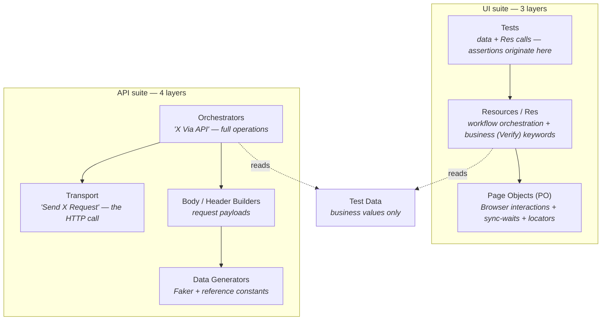

# DemoQA — Robot Framework Test Suite

End-to-end **UI and API** test automation for [demoqa.com](https://demoqa.com), built with Robot Framework. UI tests run on the **Browser library (Playwright-backed)**; API tests run on RequestsLibrary. Strict layered architecture, dual CI (Jenkins + GitHub Actions), and a published Allure report.

[](https://github.com/TahaFaisal00/demoqa/actions/workflows/ci.yml)
[](https://tahafaisal00.github.io/demoqa/)


**Live report:** an interactive [Allure test report](https://tahafaisal00.github.io/demoqa/) is published to GitHub Pages — open it to browse the full run with no setup.

---

## Overview

This suite tests the DemoQA Book Store application across two interfaces — the browser UI and the REST API — plus end-to-end user journeys that span both. It covers positive flows, negative flows, and **bug-documenting tests** that capture real defects in the target site without breaking the build.

The repo is built around two ideas beyond raw coverage:

- **Strict layering** — every locator, wait, and business assertion has exactly one layer it is allowed to live in, enforced consistently across the suite.
- **Honest handling of a buggy, non-deterministic target.** DemoQA has genuine defects: a confirmation modal that intermittently fails to close, a frontend that doesn't react to account deletion, and reCaptcha that fires unpredictably. Where a defect is *plumbing* on the way to an assertion, the suite routes around it via the API; where the defect *is* the behavior under test, it's documented rather than forced green. That decision is made explicitly, test by test.

---

## Tech stack

| Concern               | Tool                          |
| --------------------- | ----------------------------- |
| Test framework        | Robot Framework 7.4           |
| Language runtime      | Python 3.14                   |
| UI automation         | Browser library (Playwright)  |
| API automation        | RequestsLibrary               |
| Test data generation  | FakerLibrary                  |
| Built-ins             | Collections, String           |
| Reporting             | Allure                        |
| CI/CD                 | Jenkins · GitHub Actions      |

---

## Architecture

The UI suite is a three-layer design; the API suite is a four-layer design. Responsibilities never leak across boundaries.



**The rules that hold the suite together:**

- **Sync-waits vs. business assertions never mix.** A `Wait For Elements State` proves an action *landed*; a `Verify` keyword proves a *requirement* was met. Different jobs, different layers.
- **Locators live inside Page Objects.** Business values live in test data files. A locator never appears in a test; a hard-coded business value never appears in a Page Object.
- **The API suite has no Page Object layer** — it's split into Data Generators → Body/Header Builders → Transport → Orchestrators instead.
- **`VAR scope=TEST`** carries credentials and IDs (`${TOKEN}`, `${ACCOUNT_ID}`, `&{TEST_ACCOUNT}`) across the boundary between API setup and UI execution within a test.
- **Resilient teardowns** — cleanup runs under `Run Keyword And Ignore Error` so a half-failed setup can't cascade into a teardown failure.

---

## Project structure

```
demoqa/
├── Resources/
│   ├── Common.robot              # Browser/session setup, test isolation, teardown
│   ├── UI_TestData.robot         # UI business values
│   ├── API_TestData.robot        # API business values + reference constants (ISBNs)
│   ├── DemoqaRes.robot           # UI workflow / business (Verify) keywords
│   ├── API_RES.robot             # API workflow / orchestration keywords
│   └── PO/                       # Page Objects: Browser interactions, sync-waits, locators
│       ├── ToolsQA.robot
│       ├── LogIn.robot
│       ├── BookStore.robot
│       └── Profile.robot
└── Tests/
    ├── UI_Tests.robot            # UI functional + bug-documenting tests
    ├── APIsTests/                # API tests grouped by resource
    │   ├── AccountAPIs.robot
    │   └── BookStoreAPIs.robot
    └── E2E_Tests/
        ├── UI_E2E.robot          # Full browser user journey
        └── API_E2E.robot         # Full account lifecycle over the API
```

---

## Test coverage

**UI — `Tests/UI_Tests.robot` (Browser library)**
Login and logout, book search (positive results and empty-state), adding books to a collection and verifying presence, book-detail field verification, and account lifecycle. Account creation and deletion are driven **via the API** inside UI tests — see *Working around a buggy target* below.

**API — `Tests/APIsTests/`** — grouped by resource:
- `AccountAPIs.robot` — create user, generate token, authorize, delete (positive + unauthorized / invalid paths).
- `BookStoreAPIs.robot` — add list of books, single and bulk delete, replace book, get book details (positive + invalid-field, missing-ISBN, already-deleted paths).

**End-to-end — `Tests/E2E_Tests/`** — journeys that exercise the full stack:
- `UI_E2E.robot` → `Full User Experience Via UI` — UI login → browse store → add two books → verify both present → delete account via API → verify logout.
- `API_E2E.robot` — a full seven-step account lifecycle with state-verification read-backs (`GET /Account/v1/User/{id}`) after each mutation, asserting a deleted account can no longer authenticate.

---

## Working around a buggy target

DemoQA is a public demo site with real, reproducible defects. The suite makes a deliberate call on each one:

| Defect | Handling |
| ------ | -------- |
| reCaptcha fires unpredictably on UI registration | Accounts created **via API** — UI registration can't be driven reliably |
| Delete-confirmation modal intermittently fails to close / detaches mid-click (~1 in 5 runs) | Deletion driven **via API** in lifecycle tests; the modal flake is documented, not asserted |
| Frontend stays "logged in" after the backend revokes the session on account deletion | Documented as a report-only finding |
| Single-delete returns `400` where `404` is correct; error bodies leak HTML / stack traces | Captured as `bug`-tagged tests asserting actual behavior |

**The rule:** if the buggy action is *plumbing* to reach a deterministic assertion, bypass it via the API. If the buggy action *is* the behavior under test, it can't be bypassed — it's documented instead. Non-deterministic defects are never asserted in green CI.

---

## Tagging strategy

Tests are tagged on four axes so any slice can be run on demand:

- **Layer** — `ui`, `api`
- **Type** — `functional`, `bug`
- **Expectation** — `positive`, `negative`
- **Resource** — `account`, `bookstore`

```bash
robot --include "ui AND positive" Tests/     # UI happy paths only
robot --exclude bug Tests/                    # skip known-defect tests
robot --include account Tests/                # everything touching the account resource
```

---

## Bug-documenting tests

Some tests deliberately assert the site's **actual broken behavior** rather than the correct behavior, tagged `bug` with an inline comment stating *expected vs. actual*. This keeps CI green while pinning the defect: if the site is ever fixed, the test fails loudly and tells you the bug is gone. It is a record of known issues, not a source of false failures. The full set of findings — including non-deterministic ones that are reported rather than asserted — is documented in [BUGS.md](BUGS.md).

---

## CI/CD

**GitHub Actions** (`.github/workflows/ci.yml`) runs the suite live on every push. DemoQA does **not** block datacenter IPs — verified by running it — so the cloud runner executes the real suite rather than a dry run.

**Jenkins** runs the same suite in a declarative pipeline (`Jenkinsfile`): checkout → build isolated virtual environment → `rfbrowser init` → headless execution → Robot Framework result publishing.

**Pipeline stages**


**Latest run — Robot Framework results, with trend and per-suite breakdown**


```bash
# 1. Install dependencies (into a virtual environment)
pip install -r requirements.txt
rfbrowser init

# 2. Run everything
robot Tests/

# 3. Run a single area
robot Tests/UI_Tests.robot
robot Tests/APIsTests/
robot Tests/E2E_Tests/

# 4. Generate the Allure report locally
robot --listener allure_robotframework:allure-results Tests/
allure serve allure-results
```

Results are written to `log/output.xml`, `log/log.html`, and `log/report.html`.

---

## License

For demonstration and portfolio purposes.
